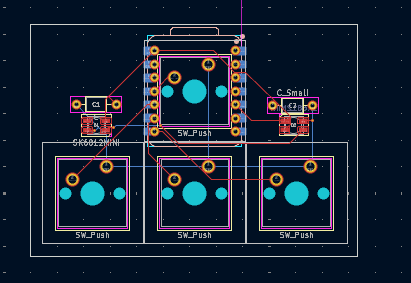
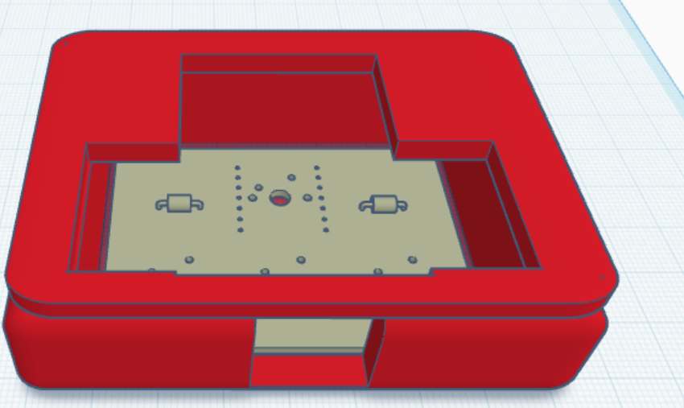

# HeckPed

The Hack Pad journey. Make sure you read the entire README and all its notes, it's all chronological (it's like a Journalplzreadme.md)

### BOM

* Two capacitors of type 0.1uf (I will be purchasing this, no biggie), it's coming in this set: https://www.amazon.com/ALLECIN-Electrolytic-Capacitor-Assortment-Kit/dp/B0C1VBXCQM?sr=8-2
* Four Switches of type Cherry Red 45cn
* Four Keycaps (i dont care which type as long as they are White/Black and semi low profile [not chonky])
* Two LED Diodes
* One printed part (CAD list)
* 1 PCB
* 1x XIAO RP2040

No top panel, it'd be easy but I want to see the electronics anyways cuz it's cool. I might think about a clear panel in the future which is why I kept the screws.

6/30/2025 Updates:

Notes: The decoupling capacitors are in the correct format, I have checked with multiple sources (no, I did not check with AI, thanks for asking). 

I have size checked the PCB to the CAD and created a complete CADout of the entire design with good amounts of breathing room and a top panel. The PCB now runs the DRC checks with no errors (ignore the footprint warnings, those do not impact anything and I have checked them with the capacitors I will be using, no impact whatsoever). 

I updated the PCB here, THANK YOU MEDDY. Well WE

There is also a top part of the CAD. There are 3 parts in the CAD directory.
Here's the complete part:

There is also a production folder with Gerber and drill files, CAD case designs (top and bottom separated, no CADOUT inside production for PCB) and firmware customized to my use case.

## VERY IMPORTANT NOTE 
Logan made me put this here

I will be drilling the top plate into the bottom plate as I've had issues with wiggling in the past. Drilling will be way more stable.

I will also be elevating the XIAO slightly so it fits with the keyboard switch there.