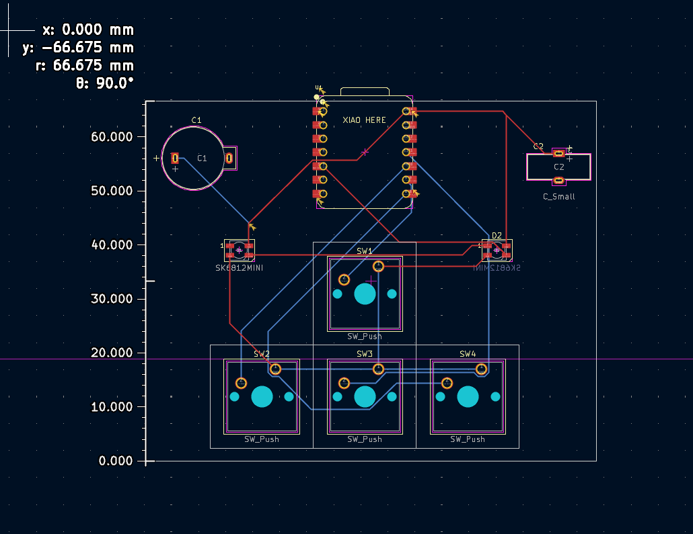
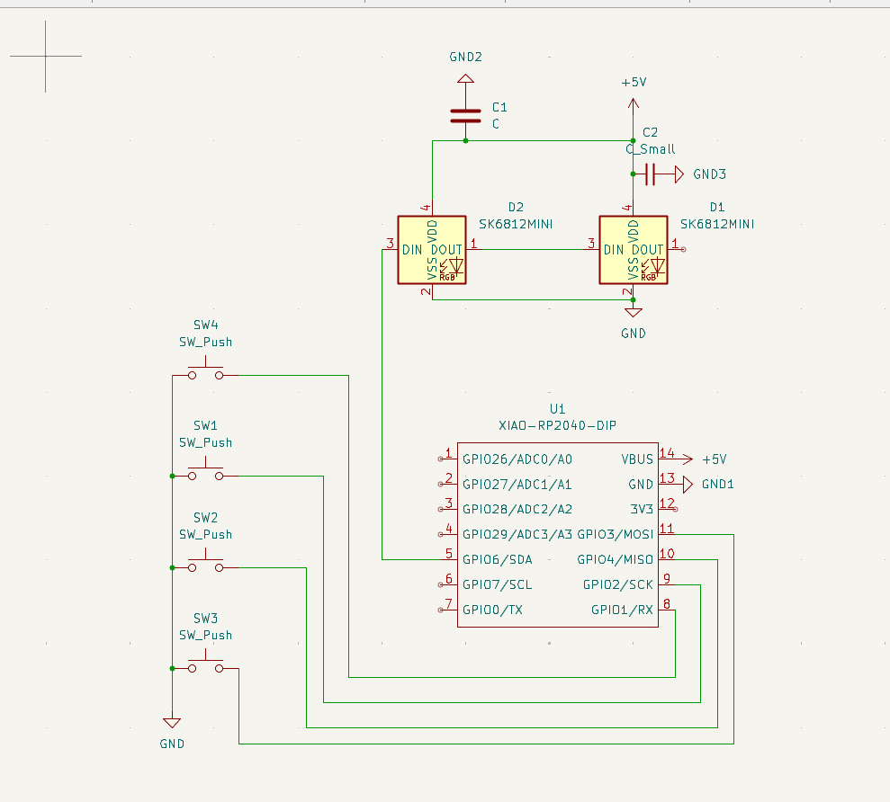
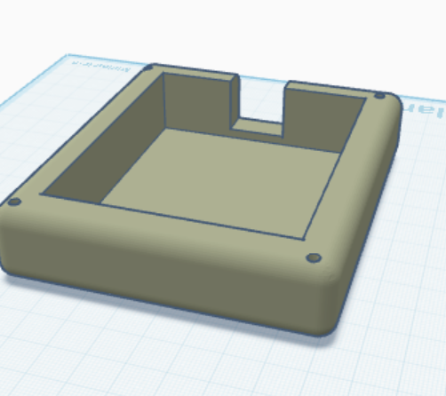

# HeckPed

The Hack Pad journey

### BOM

* Two capacitors of type 0.1uf
* Four Switches of type Cherry Red 45cn
* Four Keycaps (i dont care which type as long as they are White/Black and semi low profile [not chonky])
* Two LED Diodes
* One printed part (CAD list)
* 1 PCB
* 1x XIAO RP2040

No top panel, it'd be easy but I want to see the electronics anyways cuz it's cool. I might think about a clear panel in the future which is why I kept the screws